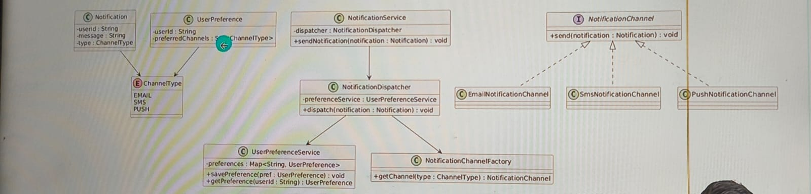

## CERID
Clarify (Requirements)
Entities
Responsibilities
Interaction
Durability (Easy to corporate changes) : Future proof 

### Bonus
Think about thread safely

### Functional Requirement
- The system should send notification to the user
- Support multiple notification channels
    - Email
    - SMS
    - Push
- A user can have preferences
    - which channel they want
- There should be retry mechanism 

### Non Funtional Requirements
- Extensible 
- Maintainable 
- Asynchronous
- Thread-safe
- Reliable

### Entity 
Core Entity
- UserPreferences
- Notification
- NotificationChanel
- NotificationChanelFactory
- NotificationService
- NotificationDispatcher

### Responsibilities

- UserPreferences : Will keep channel preferences of a user

- Notification : Will keep notification message and metadata (like chanel etc.)

- NotificationChanelInterface : Business logic to send message through a particulat chanel

- Implementaions 
    1. SmsNotificationChannel
    2. EmailNotificationChannel
    3. PushNotificationChannel

- NotificationChannelFactory : Creates different kind of notification object

- NotificationDispatcher : Dispatch user notification through multiple channels based on user preferences

- NotificationService : Entry point of the system, provides a method to send notification 

### Interaction (Relationships)

#### Define flow of execution
Typical Flow
1. Client calles NotoficationService
2. Service 
    - Fetch user preferences
    - selects appropriate channels
    - creates notification object
    - sends via channel(s)
3. If failure -> apply retry policy

#### Define Relationships
- NotificationService
    - Depends on NotificationDispatcher tp dispatch notification
- NotificationDispatcher
    - Fetches user channel preferences (depends on PreferenceService)
    - Dispatches notification to NotificationChannel and uses NotificationChannelFactory tp create different channels 
- Preference Service
    - Saves user preference objects
    - provides user preference whenever needed

